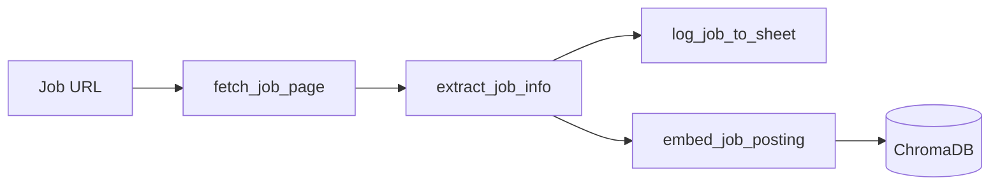
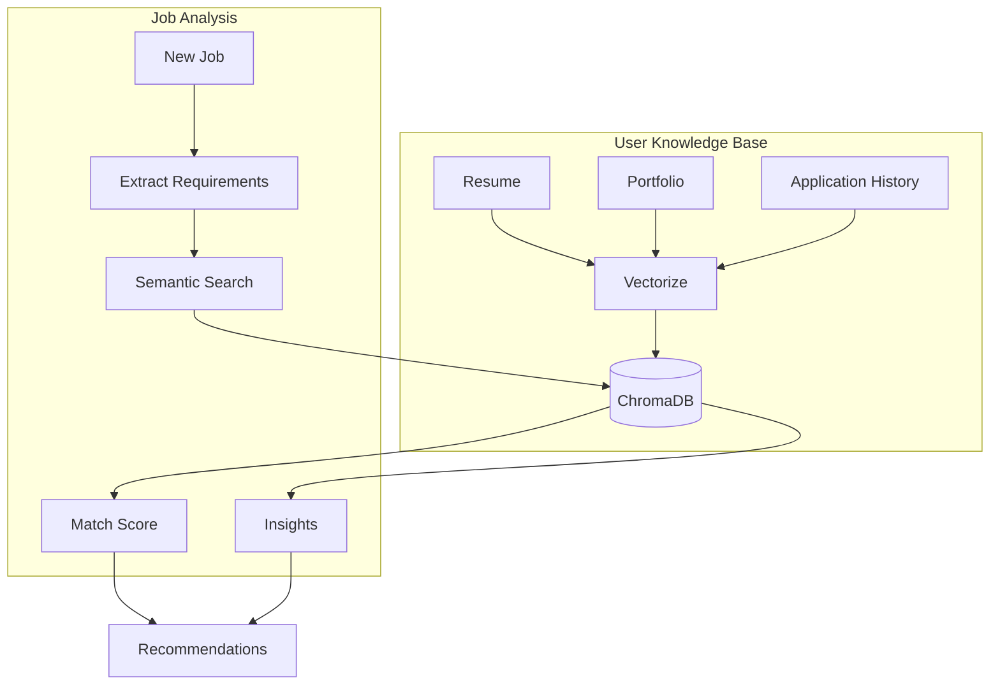
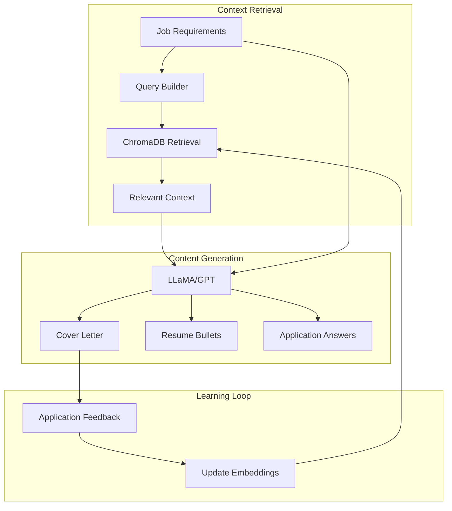

# CLAUDE.md

This file provides guidance to Claude Code (claude.ai/code) when working with code in this repository.

## Project Overview

Scout is an Intelligent AI Application Assistant that learns from your job search patterns to optimize applications. It uses RAG (Retrieval-Augmented Generation) to match job postings with your experience, generates personalized application materials, and provides data-driven insights on your job search strategy.

The system operates in three integrated modes:

### 1. Extraction Mode (Foundation)


### 2. Intelligence Mode (RAG-Powered Analysis)


### 3. Generation Mode (Personalized Content)


## Development Commands

### Environment Setup
```bash
# Create and activate virtual environment, install dependencies
./scripts/install.sh

# Manual activation
source .venv/bin/activate

# Initialize ChromaDB
python -m scout.rag.init_db
```

### Testing
```bash
# Run all tests
pytest

# Run specific test modules
pytest tests/test_rag/
pytest tests/test_extractor.py

# Run with coverage
pytest --cov=scout --cov-report=html
```

### Running the Application
```bash
# Extract and analyze a single job
python main.py analyze "https://careers.company.com/job/12345"

# Batch process multiple jobs
python main.py batch jobs_list.txt

# Generate application materials
python main.py generate "https://careers.company.com/job/12345" --cover-letter --resume-bullets

# View insights dashboard
python main.py insights --last-30-days

# Update user profile
python main.py profile update resume.pdf
```

## Project Structure
```
src/scout/
├── agent/
│   ├── job_agent.py          # Main agent orchestration
│   └── application_agent.py  # Application strategy agent
├── tools/
│   ├── fetcher.py            # HTTP fetching and HTML cleaning
│   ├── extractor.py          # LlamaIndex structured extraction
│   └── tracker.py            # Google Sheets integration
├── rag/
│   ├── __init__.py
│   ├── embeddings.py         # OpenAI text-embedding-3-small
│   ├── vectorstore.py        # ChromaDB operations
│   ├── retriever.py          # Semantic search & hybrid retrieval
│   ├── generator.py          # Content generation with context
│   └── analyzer.py           # Pattern recognition & insights
├── models/
│   ├── job.py                # JobInfo and related models
│   ├── profile.py            # UserProfile, Experience models
│   └── application.py        # ApplicationContext, Strategy models
├── utils/
│   ├── text_cleaning.py      # Text preprocessing utilities
│   └── chunking.py           # Document chunking strategies
├── config.py                 # Centralized configuration
└── cli.py                    # CLI entry point

tests/
├── test_extractor.py         # Extraction pipeline tests
├── test_fetcher.py           # HTTP and HTML parsing tests
├── test_models.py            # Model validation tests
├── test_tracker.py           # Google Sheets integration tests
└── test_rag/
    ├── test_embeddings.py    # Embedding generation tests
    ├── test_vectorstore.py   # ChromaDB operations tests
    ├── test_retriever.py     # Context retrieval tests
    └── test_generator.py     # Content generation tests

data/
├── profiles/                 # User profiles and preferences
│   ├── resume.json          # Parsed resume data
│   ├── preferences.yaml     # Job search preferences
│   └── skills.json          # Skill inventory
├── documents/                # Original documents
│   ├── resumes/
│   ├── cover_letters/
│   └── portfolio/
├── chroma/                   # ChromaDB vector storage
│   ├── user_experiences/
│   ├── job_postings/
│   └── application_history/
└── insights/                 # Generated insights cache
    ├── patterns.json
    └── recommendations.json
```

## Architecture Components

### Core Pipeline
1. **Extraction Layer**: Fetches and parses job postings into structured data
2. **Intelligence Layer**: RAG-powered analysis and pattern recognition
3. **Generation Layer**: Personalized content creation with context awareness
4. **Learning Layer**: Feedback loop to improve recommendations

### RAG Architecture

#### Vector Database Schema (ChromaDB)
```python
# Collections structure
{
    "user_experiences": {
        "embedding_dim": 1536,  # OpenAI text-embedding-3-small
        "metadata": ["doc_type", "date", "company", "role", "skills"],
        "distance_metric": "cosine"
    },
    "job_postings": {
        "embedding_dim": 1536,
        "metadata": ["company", "role", "level", "posted_date", "status"],
        "distance_metric": "cosine"
    },
    "application_materials": {
        "embedding_dim": 1536,
        "metadata": ["job_id", "material_type", "outcome", "response_rate"],
        "distance_metric": "cosine"
    }
}
```

#### Chunking Strategy
- **Resumes**: Semantic chunking by section (experience, education, skills)
- **Job Postings**: Hierarchical chunking (requirements, responsibilities, qualifications)
- **Chunk Size**: 400-600 tokens with 50-token overlap
- **Metadata Preservation**: Each chunk maintains document context

#### Retrieval Strategy
```python
# Hybrid retrieval approach
def retrieve_context(query, filters=None):
    # 1. Keyword search for exact matches (BM25)
    keyword_results = keyword_search(query, k=10)
    
    # 2. Semantic search for conceptual matches
    semantic_results = vector_search(query, k=10)
    
    # 3. Re-rank using cross-encoder
    combined = rerank(keyword_results + semantic_results)
    
    # 4. Apply metadata filters
    if filters:
        combined = apply_filters(combined, filters)
    
    return combined[:5]  # Top 5 most relevant
```

### Intelligence Features

#### Application Success Predictor
```python
# Factors analyzed:
- Skill match percentage
- Experience alignment
- Company culture fit (from past applications)
- Competition level (based on posting age, view count)
- Historical success rate for similar roles
```

#### Insight Generation
```python
# Pattern recognition across:
- Successful vs unsuccessful applications
- Response time by company type
- Optimal application timing
- Keyword correlation with interviews
- Geographic and industry trends
```

### Data Models

#### JobInfo (Extended)
```python
class JobInfo(BaseModel):
    # Original fields
    company: str
    title: str
    location: str
    url: str
    
    # RAG-enhanced fields
    embedding_id: str  # ChromaDB reference
    requirements_parsed: List[str]
    tech_stack: List[str]
    culture_keywords: List[str]
    similarity_score: float  # To user profile
    competition_estimate: str  # Low/Medium/High
```

#### ApplicationContext
```python
class ApplicationContext(BaseModel):
    job_id: str
    matched_experiences: List[Experience]
    skill_gaps: List[str]
    emphasis_recommendations: List[str]
    success_probability: float
    suggested_materials: Dict[str, str]  # Type -> Content
```

## Environment Variables
```bash
# Core
OPENAI_API_KEY=your_key_here              # LLM and embeddings
GOOGLE_SHEETS_CREDS=path_to_creds.json    # Sheets API

# RAG Configuration
CHROMA_PERSIST_DIR=./data/chroma          # Vector DB storage
EMBEDDING_MODEL=text-embedding-3-small    # OpenAI embedding model
EMBEDDING_BATCH_SIZE=100                  # Batch processing size
MAX_CONTEXT_LENGTH=2000                   # Context window for generation

# Application Settings
AUTO_ANALYZE=true                         # Auto-analyze on extraction
CACHE_EMBEDDINGS=true                     # Cache for performance
SIMILARITY_THRESHOLD=0.75                 # Minimum match score
```

## Dependencies
```toml
# Core RAG dependencies
llama-index = "^0.14.8"
llama-index-llms-openai = "^0.6.9"
llama-index-embeddings-openai = "^0.5.1"
chromadb = "^0.4.22"

# Data processing
pandas = "^2.1.0"
numpy = "^1.24.0"
scikit-learn = "^1.3.0"  # For TF-IDF in hybrid search

# APIs and Integration
gspread = "^5.12.0"
google-auth = "^2.23.0"
playwright = "^1.39.0"  # For JS-heavy sites

# Utilities
python-dotenv = "^1.2.1"
pydantic = "^2.5.0"
rich = "^13.5.0"  # Beautiful CLI output
```

## Implementation Phases

### Phase 1: Foundation (Week 1-2)
- [x] Basic extraction pipeline
- [ ] ChromaDB setup and integration
- [ ] User profile ingestion
- [ ] Simple embedding and retrieval

### Phase 2: Intelligence (Week 3-4)
- [ ] Hybrid search implementation
- [ ] Success pattern recognition
- [ ] Basic application scoring
- [ ] Insight generation engine

### Phase 3: Generation (Week 5-6)
- [ ] Context-aware cover letters
- [ ] Resume bullet optimization
- [ ] Application answer generation
- [ ] Feedback loop integration

### Phase 4: Optimization (Week 7-8)
- [ ] Performance tuning
- [ ] Caching layer
- [ ] Batch processing
- [ ] Dashboard and analytics

## Testing Strategy

### Unit Tests
- Mock OpenAI API calls
- In-memory ChromaDB for vector tests
- Fixture-based test data

### Integration Tests
- End-to-end pipeline tests
- RAG retrieval accuracy tests
- Generation quality tests

### Performance Tests
- Embedding generation benchmarks
- Retrieval latency tests
- Concurrent job processing

## Critical Constraints

1. **Privacy First**: User data never leaves local environment except for embeddings
2. **No Auto-Submit**: All applications require explicit user approval
3. **Rate Limiting**: Respect API limits for job sites and OpenAI
4. **Feedback Loop**: Every application outcome improves future recommendations
5. **Transparency**: Users can inspect why specific recommendations were made

## RAG Best Practices

1. **Embedding Quality**
   - Preprocess text to remove noise
   - Maintain semantic boundaries in chunks
   - Include metadata for filtering

2. **Retrieval Optimization**
   - Use hybrid search for best results
   - Pre-filter with metadata when possible
   - Cache frequently accessed embeddings

3. **Generation Guidelines**
   - Always cite which experiences were used
   - Maintain user's voice in generated content
   - Allow editing before submission

4. **Learning Loop**
   - Track application outcomes
   - Update embeddings with successful patterns
   - Identify and flag deteriorating strategies

## Monitoring and Analytics
```python
# Key metrics tracked:
- Application success rate by job type
- Average time to response
- Interview conversion rate
- Salary range achievement
- Geographic success patterns
```

## Future Enhancements

- **Interview Prep**: Generate likely interview questions based on job posting
- **Negotiation Assistant**: Analyze offer patterns and suggest negotiation strategies
- **Network Effects**: Anonymous sharing of success patterns across users
- **ATS Optimization**: Keyword optimization for applicant tracking systems
- **Multi-modal**: Support for portfolio images and video submissions