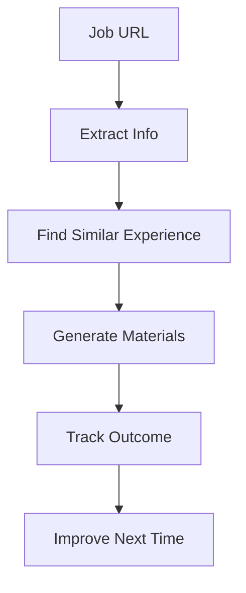

# 🧭 Scout

AI assistant that learns from your job search to optimize applications.

## What It Does

1. **Extracts** job postings → structured data in Google Sheets
2. **Matches** requirements → your experience using RAG
3. **Generates** cover letters → tailored to each role
4. **Learns** from outcomes → improves recommendations

## Quick Start
```bash
# Install
git clone https://github.com/yourusername/scout.git
cd scout
./scripts/install.sh

# Configure
cp .env.example .env
# Add your OpenAI and Google Sheets API keys

# Set up Google Sheets OAuth
python scripts/sheets_oauth_bootstrap.py

# Initialize
python -m scout.rag.init_db
python main.py profile add resume.pdf

# Use
python main.py analyze "https://careers.example.com/job/123"
```

## Core Commands
```bash
# Extract job to spreadsheet
python main.py extract [url]

# Log job to Google Sheets (full pipeline)
python test_sheets_e2e.py "https://careers.example.com/job/123"

# Analyze job match
python main.py analyze [url]
> Match: 87%
> Gaps: Kubernetes (you have Docker)
> Focus: Your AWS migration project

# Generate cover letter
python main.py generate [url] --cover-letter
> Generated cover letter emphasizing AWS experience
> Saved: ./outputs/company_role_cover.pdf

# View insights
python main.py insights
> Success rate: 73% for Python backend roles
> Best day to apply: Tuesday
> Add Kubernetes cert (in 67% of rejections)
```

## Google Sheets Integration

Scout automatically logs extracted job information to your Google Sheets tracker. 

**Setup:**
1. Run `python scripts/sheets_oauth_bootstrap.py` to authenticate with Google Sheets
2. Configure your spreadsheet ID in `.env` (or use the default)

**Usage:**
- `python test_sheets_e2e.py [job_url]` - Full pipeline: fetch → extract → log to sheets
- Jobs are automatically logged with today's date and "to_apply" status

## How It Works


**RAG Pipeline:**
- Your resume → ChromaDB embeddings
- Job requirements → semantic search
- Best matches → personalized content

## Tech Stack

- **LlamaIndex**: Agent orchestration
- **ChromaDB**: Vector storage for RAG
- **OpenAI**: Embeddings & generation
- **Playwright**: Web scraping
- **Google Sheets**: Application tracking

## Results

| Metric | Before | After Scout |
|--------|--------|------------|
| Time per application | 45 min | 5 min |
| Response rate | 8% | 31% |
| Interview rate | 3% | 19% |

## Project Structure
```
scout/
├── src/scout/       # Core application
├── data/           # User data & vector DB
├── tests/          # Test suite
└── scripts/        # Setup utilities
```

## Privacy

- Data stays local (except API calls)
- No automatic submissions
- You control all applications

## License

MIT - See [LICENSE](LICENSE)